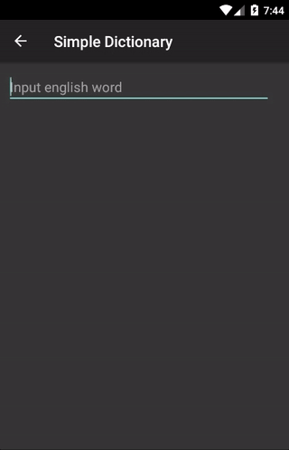

Android DynamicAutoComplete Library
===================================

[](https://travis-ci.org/slydeveloper/android-dynamic-autocomplete)
[](https://android-arsenal.com/api?level=16)
[](https://www.apache.org/licenses/LICENSE-2.0.html)

Here is a simple and easy to use library that helps extends [AutoCompleteTextView](https://developer.android.com/reference/android/widget/AutoCompleteTextView.html) with dynamically loaded data i.e via REST service.

Video
=====


Example
=====
An example project you can find in ```dynamicautocomplete-example```.

Repository
======
```Groovy
repositories {
    jcenter()
}

dependencies {
    compile 'pl.sly.dynamicautocomplete:dynamicautocomplete:1.0.0'
}
```

Changelog
=========

### Version: 1.0.0

* Initial version

Developed by
============

* Sylwester Sokołowski - <sylwek.sokolowski@gmail.com>

License
=======

    Copyright (C) 2017 Sylwester Sokołowski

    Licensed under the Apache License, Version 2.0 (the "License");
    you may not use this file except in compliance with the License.
    You may obtain a copy of the License at

          http://www.apache.org/licenses/LICENSE-2.0

    Unless required by applicable law or agreed to in writing, software
    distributed under the License is distributed on an "AS IS" BASIS,
    WITHOUT WARRANTIES OR CONDITIONS OF ANY KIND, either express or implied.
    See the License for the specific language governing permissions and
    limitations under the License.